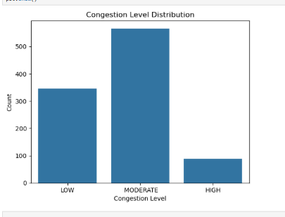
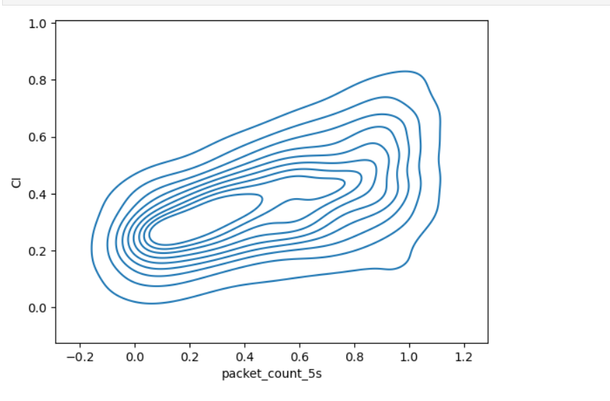
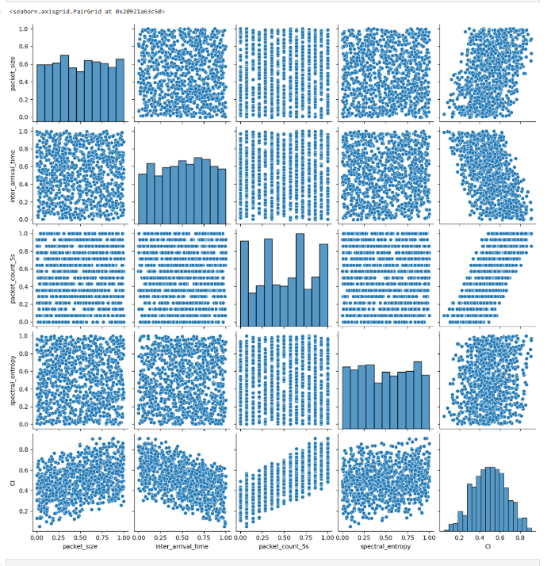

# Network Traffic Analysis Project

## Overview
This project analyzes network traffic congestion patterns using Python-based exploratory data analysis and visualization techniques. The goal is to identify trends in packet flow, congestion levels, and traffic behavior from embedded system network security data.

## Technologies Used
- Python
- Pandas
- Matplotlib
- Seaborn
- Jupyter Notebook

## Features
- Data cleaning
- Statistical analysis
- Traffic visualization
- Congestion analysis

## Visualizations
### Congestion Level Distribution:
 
  
### Congestion Intensity:
 
  
### Feature Relationship Analysis:
 

 ## Results
- Successfully analyzed network traffic congestion patterns using Python-based exploratory data analysis techniques.
- Identified relationships between traffic-related features through statistical visualizations and pair plot analysis.
- Observed variations in packet distribution and traffic density using bar plots and KDE plots.
- Correlation and feature comparison helped in understanding congestion behavior within the network dataset.
- Visualization results provided meaningful insights into network performance and traffic trends.
- The project demonstrates the effective use of data analysis and visualization tools for network traffic monitoring.

## Key Insights
- Certain traffic features show noticeable correlation with congestion levels.
- Traffic distribution is uneven across different network conditions.
- Pair plot analysis reveals relationships among packet-based parameters.
- Density analysis indicates possible congestion concentration regions within the dataset.
- Visual analytics can help in identifying abnormal or high-traffic network behavior.

## Conclusion
This project successfully demonstrates how Python and data visualization techniques can be used to analyze network traffic congestion patterns. 
Using exploratory data analysis methods, the dataset was examined to identify feature relationships, traffic distributions, and congestion-related trends. 
The visualizations helped in gaining meaningful insights into network behavior and showed the importance of analytical approaches in network monitoring and security analysis.

## How to Run
1. Clone the repository
2. Install dependencies
3. Run the notebook in Jupyter Notebook

## Future Improvements
- Add machine learning classification models
- Build a real-time dashboard
- Perform anomaly detection
- Integrate predictive congestion analysis

## Author
Arushi Parashar
